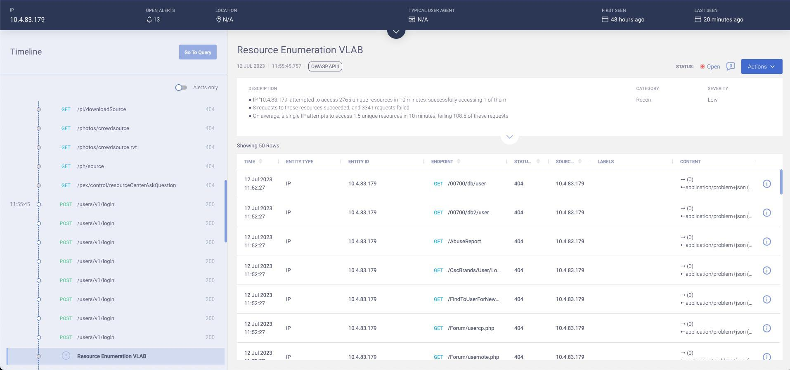

# Module 3

### Exercise 3.1 - Resource Enumeration

Resource enumeration enable attackers to find endpoints and increase the attack surface available to them. This could be done using small targeted word lists. In the lab below we will run this attack againt VAmPI, a industry standard vulnerable API. 

1. We are going to use the fuzz list for this. We are using xer0dayz [xer0dayz' Github](https://github.com/1N3) which is located in the ~/API_Sec_Lab/IntruderPayloads/dirbuster-quick.txt
2. Let's look how easy this is by looking at the script that we will run to execute this attack. Type the following command `cat ~/resource_enum.py`. The code should look like this:

#import requests

        host = 'http://10.50.100.45:5000/'
        file1 = open('./API_Sec_Lab/IntruderPayloads/dirbuster-quick.txt', 'r')
        Lines = file1.read().splitlines()

        count = 0
        for line in Lines:
            count += 1
            x = requests.get(host + line, verify=False)
            print('Resource: ' + line + ' | ' + str(x.status_code))

3. From the command line type the following commands:

        cd
        pip install requests
        python resource_enum.py

4. The output should look like this:

>Resource: /phpMyAdmin/ | 404
>Resource: /wp/ | 404
>Resource: /wordpress/ | 404
>Resource: /drupal/ | 404
>Resource: /cms/ | 404

5. Go to Akamai API Security portal at [Akamai API Security Portal](https://app.neosec.com/)
6. Log in with lab credentials from Lesson 1

